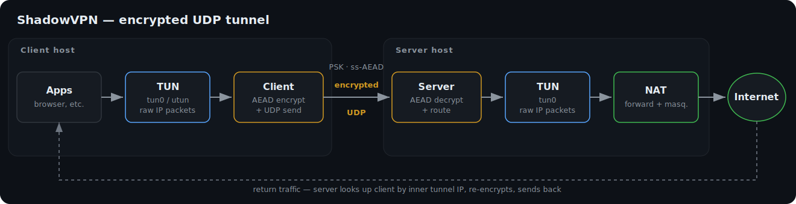
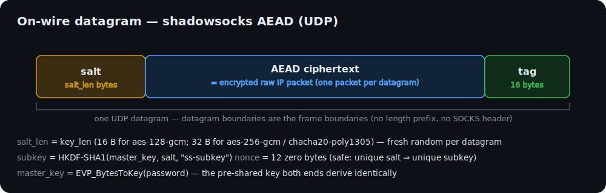
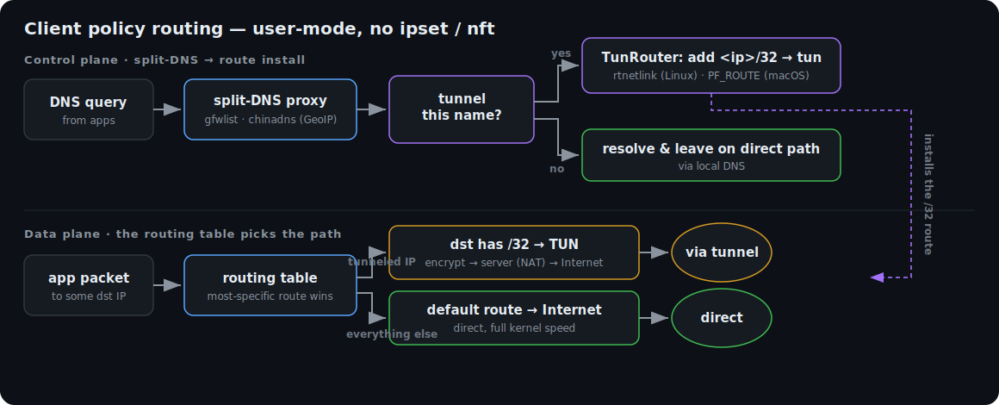

# ShadowVPN

A UDP-based, pre-shared-key (PSK), user-mode VPN written in Rust on the
[`tokio`](https://tokio.rs) async runtime.

ShadowVPN is a fixed point-to-point / multi-client tunnel. A TUN-based **client**
reads IP packets from a virtual interface, encrypts each as a single UDP
datagram, and sends it to the **server**; the server decrypts, routes, and
tunnels return traffic back. It runs on macOS (utun) and Linux, and the client
also runs on Windows (TUN via [Wintun](https://www.wintun.net/)), including
policy routing (below).

The on-wire crypto matches the **shadowsocks.org AEAD UDP scheme** exactly, so
the construction is spec-correct and interoperable, with one deliberate,
documented deviation (no SOCKS address header — see below).

> **Landing page:** a visual overview lives at
> [**madeye.github.io/shadowvpn**](https://madeye.github.io/shadowvpn/)
> (source in [`docs/`](docs/)).

<p align="center">
  
</p>

---

## Wire protocol

Each UDP datagram on the wire is:

```text
[ salt (salt_len bytes) ] ++ [ AEAD ciphertext ++ tag (16 bytes) ]
```

<p align="center">
  
</p>

* **`salt_len == key_len`** of the cipher: 16 bytes for `aes-128-gcm`,
  32 bytes for `aes-256-gcm` and `chacha20-poly1305`. A fresh random salt is
  generated for **every** datagram.
* **Subkey:** `subkey = HKDF-SHA1(ikm = master_key, salt = salt,
  info = "ss-subkey", L = key_len)`.
* **Nonce:** the all-zero 12-byte nonce for every UDP packet. This is safe
  because each datagram has a unique random salt and therefore a unique subkey,
  so the `(subkey, nonce)` pair is never reused.
* **Master key:** derived from the password string with shadowsocks'
  `EVP_BytesToKey` (the OpenSSL legacy MD5-based KDF): repeatedly compute
  `d_0 = MD5(password)`, `d_i = MD5(d_{i-1} ++ password)`, and concatenate until
  `key_len` bytes are available. (Implemented in-tree; no external crate.)
* **Plaintext:** the raw IP packet read from the TUN device. UDP datagram
  boundaries are the frame boundaries — there is no length prefix, no
  multiplexing, and no reassembly. One IP packet maps to exactly one datagram.

### Deviation from ss-proxy

Standard shadowsocks UDP relays prepend a SOCKS-style target address to the
plaintext. **ShadowVPN does not.** This is a fixed point-to-point tunnel, not a
SOCKS proxy: the plaintext is exactly the raw IP packet, with no address header.
Everything else (salt, HKDF-SHA1 `"ss-subkey"` subkey, zero nonce, AEAD tag)
matches the shadowsocks UDP AEAD scheme byte-for-byte. This deviation is also
documented in `src/crypto.rs` and `src/protocol.rs`.

### Keepalive (ShadowVPN convention, not part of the ss spec)

The client periodically sends a tiny encrypted datagram (a 1-byte `0x00`
plaintext) so that stateful NAT/firewall mappings stay open and the server
learns the client's current source address before any real traffic flows. The
server drops any decrypted payload smaller than a 20-byte IPv4 header, so the
keepalive never reaches the TUN write path.

---

## Supported ciphers

All ciphers are AEAD, from the RustCrypto project. Nonce length is 12 bytes and
tag length is 16 bytes for all three.

| Cipher name (config)                       | Key / salt length | Crate              |
|--------------------------------------------|-------------------|--------------------|
| `aes-128-gcm`                              | 16 bytes          | `aes-gcm`          |
| `aes-256-gcm`                              | 32 bytes          | `aes-gcm`          |
| `chacha20-poly1305`                        | 32 bytes          | `chacha20poly1305` |

The alias `chacha20-ietf-poly1305` is accepted and treated as
`chacha20-poly1305`. The default cipher (when none is specified) is
`chacha20-poly1305`.

---

## Carrier obfuscation (optional)

By default the UDP payload on the wire is the bare `salt ++ AEAD` envelope. The
optional `obfs` field shapes that payload so it doesn't read as an opaque
random-looking UDP blob, to evade naive protocol classification. It is selected
with the `obfs` config field and **both ends must agree** — a mismatched peer
just sees its traffic dropped.

This is **cosmetic framing only**: it adds no security. The AEAD envelope
underneath is unchanged, and a wrong/absent obfuscation simply fails to decode
(the packet is dropped before decryption).

| `obfs`   | On the wire                                                                                   | Note                                              |
|----------|----------------------------------------------------------------------------------------------|---------------------------------------------------|
| `none`   | the plain `salt ++ AEAD` datagram (default)                                                   | —                                                 |
| `quic`   | each datagram is wrapped as a **QUIC 1-RTT short-header** packet, so it reads as HTTP/3       | adds a few header bytes; self-describing decode    |
| `base64` | each datagram is **standard base64**, so the UDP payload is printable ASCII                   | ~33% larger — size the `mtu` down to compensate    |

Set it in both config files (it has no CLI flag):

```json
{
  "server": "vpn.example.com:8388",
  "password": "correct horse battery staple",
  "obfs": "quic"
}
```

The server logs the active mode in its startup banner. The wire formats are
documented in `src/obfs.rs`.

---

## Configuration

Configuration can come from a JSON config file, CLI flags, or both. **CLI flags
take precedence over JSON file values.** Defaults are applied for anything not
supplied.

### Fields

| JSON field    | CLI flag          | Meaning                                                         | Required | Default              |
|---------------|-------------------|----------------------------------------------------------------|----------|----------------------|
| `server`      | `--listen` / `--server` | server: UDP bind address; client: remote `host:port`     | yes      | —                    |
| `password`    | `-k, --password`  | pre-shared password; master key derived from it                | yes      | —                    |
| `cipher`      | `-m, --cipher`    | AEAD cipher name                                               | no       | `chacha20-poly1305`  |
| `tun_name`    | `--tun-name`      | explicit TUN interface name (e.g. `utun7`, `tun0`)            | no       | OS picks             |
| `tun_ip`      | `--tun-ip`        | local IPv4 address on the TUN interface                       | yes      | —                    |
| `tun_netmask` | `--tun-netmask`   | IPv4 netmask for the TUN interface                            | no       | `255.255.255.0`      |
| `peer_ip`     | `--peer-ip`       | point-to-point peer IPv4 (server: client IP; client: server IP)| yes     | —                    |
| `mtu`         | `--mtu`           | TUN interface MTU                                              | no       | `1400`               |
| `obfs`        | *(config only)*   | carrier obfuscation: `none` \| `quic` \| `base64` (both ends must match) | no | `none`               |

On the **server** the `server` field is the UDP bind/listen address; on the
**client** it is the remote server address to connect to. Both binaries accept
`-c, --config <PATH>` to point at a JSON file.

### Example: server config (`server.json`)

```json
{
  "server": "0.0.0.0:8388",
  "password": "correct horse battery staple",
  "cipher": "chacha20-poly1305",
  "tun_name": "utun7",
  "tun_ip": "10.9.0.1",
  "tun_netmask": "255.255.255.0",
  "peer_ip": "10.9.0.2",
  "mtu": 1400
}
```

### Example: client config (`client.json`)

```json
{
  "server": "vpn.example.com:8388",
  "password": "correct horse battery staple",
  "cipher": "chacha20-poly1305",
  "tun_name": "utun7",
  "tun_ip": "10.9.0.2",
  "tun_netmask": "255.255.255.0",
  "peer_ip": "10.9.0.1",
  "mtu": 1400
}
```

Note how `tun_ip` and `peer_ip` are mirror images: the server's local tunnel IP
is the client's peer, and vice versa.

### Share a client config as a URI / QR code

A client config can be exported as a single `shadowvpn://` URI (the config JSON,
URL-safe Base64) and imported back — handy for moving a config to another device
by copy-paste or by scanning a QR code:

```sh
# Print the shadowvpn:// URI for a config…
shadowvpn-client uri export -c client.json

# …or also render a scannable QR code to the terminal:
shadowvpn-client uri export -c client.json --qr

# Import a URI back into a JSON config (omit -o to print to stdout):
shadowvpn-client uri import 'shadowvpn://…' -o client.json

# Import by decoding a QR-code image instead of pasting the URI:
shadowvpn-client uri import --image config-qr.png -o client.json
```

The URI carries every config field, but file-path fields (`gfwlist`, `chnroute`,
`geoip`, `cache_file`) are only meaningful on the host that has those files —
re-point them after importing. When several clients share one server, give each a
distinct `tun_ip`: the server routes return traffic by inner tunnel IP, so two
clients with the same `tun_ip` would collide.

---

## Building

Requires a recent stable Rust toolchain (edition 2021).

```sh
cargo build --release
```

This produces two binaries:

* `target/release/shadowvpn-server`
* `target/release/shadowvpn-client`

Run the test suite (crypto + config unit tests):

```sh
cargo test --lib
```

It also builds on **Windows** (`x86_64-pc-windows-msvc` / `aarch64-pc-windows-msvc`)
with the MSVC toolchain; CI builds and tests the Windows target on every push. The
client's TUN layer uses [Wintun](https://www.wintun.net/), whose `wintun.dll` is
loaded at runtime and must sit next to `shadowvpn-client.exe` — download the build
matching the CPU architecture and drop it alongside the binary. See
[`scripts/`](scripts/) for a ready-made launcher.

### End-to-end test (Docker)

A full data-path test lives under `docker/`. It builds both binaries, starts a
**server** and a **client** container — each with its own TUN device — on a
private bridge network, and then pings the server's in-tunnel address from the
client. A successful, lossless ping exercises the entire path: TUN → encrypt →
UDP → server → decrypt → TUN, and the reply all the way back.

```sh
./docker/run-e2e.sh                 # default cipher (chacha20-poly1305)
./docker/run-e2e.sh aes-256-gcm     # any supported cipher
```

The containers need `NET_ADMIN` and `/dev/net/tun` (the compose file requests
both). The script exits non-zero if connectivity through the tunnel fails, so it
doubles as the CI gate (see `.github/workflows/ci.yml`, which runs it across all
three ciphers alongside `fmt` + `clippy` + unit tests).

### HTTP/3-over-tunnel test (Docker)

A second, more demanding test proves ShadowVPN carries arbitrary UDP traffic by
running **real HTTP/3 (QUIC)** through the tunnel. The server enables IP
forwarding and masquerades the tunnel subnet to the internet; the client routes
**all** egress through the tunnel (its default route is deleted, so the only way
out is via ShadowVPN) and fetches a QUIC site with an HTTP/3-only `curl`:

```sh
./docker/run-e2e-http3.sh                       # default: https://www.cloudflare-quic.com/
TARGET_URL=https://cloudflare-quic.com/ ./docker/run-e2e-http3.sh aes-256-gcm
```

The test passes when the response is delivered over **HTTP/3** (`http_version=3`);
the application status code is irrelevant (Cloudflare may bot-block with `403` —
the point is that the QUIC handshake and HTTP/3 exchange completed over the
tunnel). It runs on a private bridge network with any host proxy neutralized, so
QUIC must travel through ShadowVPN rather than around it. In CI this job runs on
pushes to `main` and on manual dispatch (it depends on external connectivity).

### Policy-routing test (Docker)

Exercises [policy routing](#policy-routing-gfwlist--chinadns--client-linux--macos--windows)
end to end. The topology puts a source-IP echo server behind the tunnel and
another on the LAN: a tunneled request shows up as the *server's* address, a
direct one as the *client's*, so the two paths are unambiguous. It verifies that
both modes tunnel the selected domain and leave the other direct:

```sh
./docker/run-e2e-policy.sh             # both gfwlist and chinadns
./docker/run-e2e-policy.sh gfwlist     # one mode
```

Fully self-contained (no external network), so CI runs it on every PR.

---

## Running

Creating a TUN device requires elevated privileges (root on Linux, `sudo` on
macOS, **Administrator** on Windows). Both binaries log to stderr; set
`RUST_LOG=debug` for verbose tracing.

### Server

```sh
sudo ./target/release/shadowvpn-server -c server.json
```

Or entirely via CLI flags:

```sh
sudo ./target/release/shadowvpn-server \
  --listen 0.0.0.0:8388 \
  --password "correct horse battery staple" \
  --cipher chacha20-poly1305 \
  --tun-ip 10.9.0.1 \
  --peer-ip 10.9.0.2
```

### Client

```sh
sudo ./target/release/shadowvpn-client -c client.json
```

Or via CLI flags:

```sh
sudo ./target/release/shadowvpn-client \
  --server vpn.example.com:8388 \
  --password "correct horse battery staple" \
  --cipher chacha20-poly1305 \
  --tun-ip 10.9.0.2 \
  --peer-ip 10.9.0.1
```

Once the tunnel is up you can verify connectivity with a ping across the tunnel
addresses, e.g. from the client `ping 10.9.0.1`.

### Windows (client)

Put `shadowvpn-client.exe`, `wintun.dll` (matching the CPU architecture), and your
`client.json` in one folder, then run from an **elevated** PowerShell:

```powershell
.\shadowvpn-client.exe -c client.json
```

Wintun and the routing/DNS changes need Administrator, so launch the terminal with
*Run as administrator*. Stop the client with **Ctrl-C** for a graceful shutdown
(it restores the system resolver, removes the per-destination routes, and saves the
DNS cache); avoid `taskkill /F`, which skips that cleanup.

The [`scripts/`](scripts/) folder has a self-elevating launcher that does this for
you — `shadowvpn-client.cmd` (or `shadowvpn-client.ps1 -Config <path>`); see
[`scripts/README.md`](scripts/README.md).

### Running as a service

Example service definitions live in [`dist/`](dist/): **systemd** units for the
Linux server and client, and a **launchd** daemon for the macOS client. See
[`dist/README.md`](dist/README.md) for install steps. Stopping the client service
is graceful — it restores the system resolver, removes the tunnel routes, and
saves the DNS cache. On **Windows**, use the launcher in [`scripts/`](scripts/)
(foreground; stop with Ctrl-C).

---

## Policy routing (gfwlist / chinadns) — client, Linux + macOS + Windows

By default the client is a *full* tunnel: every packet that reaches the TUN is
encrypted to the server, and what you route into the TUN is your business (see
the next section). For the common case of "send only some destinations through
the tunnel", the client has a built-in **policy-routing** mode — no external
daemon, and no `ipset`/`iptables`/`nft` required.

A small **split-DNS proxy** runs inside the client. For each query it decides
whether the name should be tunneled and, for those that should be, programs a
per-destination host route (`<ip>/32`) into the tun device using the OS's native
routing socket — **rtnetlink on Linux, `PF_ROUTE` on macOS** — so the work is
done entirely in user mode. The route's source is the tun address, so the
server's masquerade matches with no client-side NAT. Direct (non-tunneled)
traffic stays on the normal kernel path untouched, and every route added is
removed again on exit.

The proxy is built for low latency:

* **Cache** — answers are cached (TTL-respecting, like `dnsmasq`) so repeat
  lookups skip the upstream round-trip.
* **chinadns fast-path** — the local and clean resolvers are queried
  concurrently, but a **domestic answer returns immediately** instead of waiting
  for the slower tunneled upstream, so China sites resolve at local-DNS speed.
* **Pre-warm** — on startup a built-in list of common domains is resolved in the
  background, so their first real lookup (and their tunnel routes) are already
  hot. Customize with the `prewarm` config list or disable with `--no-prewarm`.
* **Persistence** — the cache is saved on exit and reloaded on startup
  (`--cache-file`, default `dns-cache.json` next to the binary; `--no-cache-persist`
  to disable), so a restart doesn't start cold.

<p align="center">
  
</p>

Two modes:

| Mode       | Decision                                                            | Needs       |
|------------|--------------------------------------------------------------------|-------------|
| `gfwlist`  | tunnel names listed in a gfwlist file; everything else is direct    | `--gfwlist` |
| `chinadns` | query a domestic + a clean resolver; tunnel anything **not** resolving to an in-China address. An optional `--gfwlist` is a force-tunnel override | `--chnroute` or `--geoip` (+ optional `--gfwlist`) |
| `full`     | no policy routing (the default)                                     | —           |

```sh
# gfwlist mode: tunnel only the domains in gfwlist.txt
sudo ./target/release/shadowvpn-client -c client.json \
  --mode gfwlist --gfwlist /etc/shadowvpn/gfwlist.txt

# chinadns mode: tunnel everything that isn't a China IP (CIDR file)
sudo ./target/release/shadowvpn-client -c client.json \
  --mode chinadns --chnroute /etc/shadowvpn/chnroute.txt

# chinadns mode: derive the China set from a GeoLite2 database instead
sudo ./target/release/shadowvpn-client -c client.json \
  --mode chinadns --geoip /etc/shadowvpn/GeoLite2-Country.mmdb

# chinadns mode + a gfwlist force list: domains on the list always tunnel,
# even if the domestic resolver returns an in-China (poisoned) address
sudo ./target/release/shadowvpn-client -c client.json \
  --mode chinadns --geoip /etc/shadowvpn/GeoLite2-Country.mmdb \
  --gfwlist /etc/shadowvpn/gfwlist.txt
```

Policy routing only takes effect for names resolved **through** the proxy (that's
what installs the routes), so the system resolver must point at it. By default
the client does this for you: on startup it points the OS resolver at the proxy
(`networksetup` on macOS, `/etc/resolv.conf` on Linux) and **restores the
previous setting on exit** — including on Ctrl-C / `SIGTERM`, which it handles for
a clean shutdown. Pass `--no-set-dns` to manage DNS yourself instead. Automatic
setup only applies when `dns_listen` uses port 53 (the OS resolver can't target a
custom port) — which is the default, so it works out of the box; if you move the
proxy to another port, point your resolver at it manually.

Relevant config / flags (all client-only; CLI overrides JSON):

| JSON field    | CLI flag        | Meaning                                                    | Default              |
|---------------|-----------------|-----------------------------------------------------------|----------------------|
| `mode`        | `--mode`        | `full` \| `gfwlist` \| `chinadns`                          | `full`               |
| `dns_listen`  | `--dns-listen`  | address the split-DNS proxy listens on                    | `127.0.0.1:53`       |
| `dns_local`   | `--dns-local`   | domestic / direct DNS upstream                            | `114.114.114.114:53` |
| `dns_remote`  | `--dns-remote`  | clean DNS upstream (reached through the tunnel)           | `8.8.8.8:53`         |
| `gfwlist`     | `--gfwlist`     | domain-suffix file (gfwlist mode; optional force-tunnel list in chinadns mode) | —                    |
| `chnroute`    | `--chnroute`    | China CIDR file (chinadns mode)                           | —                    |
| `geoip`       | `--geoip`       | GeoLite2/GeoIP2 `.mmdb`; builds the China set from it     | —                    |
| `geoip_country` | `--geoip-country` | ISO country code to select from the GeoIP database    | `CN`                 |
| `set_dns`     | `--set-dns` / `--no-set-dns` | point the system resolver at the proxy (auto-restored on exit) | `true` (needs `dns_listen` port 53) |
| `prewarm`     | `--no-prewarm`  | pre-resolve common domains into the cache on startup        | built-in list        |
| `cache_file`  | `--cache-file` / `--no-cache-persist` | persist the DNS cache across restarts        | `dns-cache.json` (next to the binary) |

* **gfwlist file** — one domain per line; `#`/`!` comments and a leading `*.`/`.`
  are accepted (the plain list produced by `gfwlist2dnsmasq`, not the base64
  blob). A name matches if it equals or is a subdomain of a listed suffix.
* **chnroute file** — one `a.b.c.d/len` per line (the classic APNIC-derived
  `chnroute.txt`).
* **geoip database** — a MaxMind `GeoLite2-Country.mmdb` (or paid GeoIP2). On
  startup every IPv4 network whose country is `--geoip-country` (default `CN`) is
  enumerated and merged into the China set, so you don't have to maintain a CIDR
  file. Takes precedence over `--chnroute` when both are given.

This needs root / Administrator (to create the tun and edit the routing table)
and runs on **Linux, macOS, and Windows**; routes are programmed directly via the
OS routing interface (rtnetlink, `PF_ROUTE`, or the Windows IP Helper API), so no
`ipset`/`iptables`/`route`/`netsh` binaries are involved for routing. The
`docker/run-e2e-policy.sh` test exercises both modes end to end. (The server still
needs forwarding + NAT so tunneled traffic can egress — see below.)

---

## TUN setup, routing, and IP forwarding

ShadowVPN brings the TUN interface up (address, netmask, peer, MTU) but
**deliberately does not touch the system routing table or `sysctl`**. Doing so
silently is dangerous and platform-specific. The steps below are what you run
**outside** the process. The binaries also print these hints at startup.

### Server: enable IP forwarding + NAT

So that tunneled clients can reach the wider network through the server, the
server host must forward packets and NAT (masquerade) them out its WAN
interface. Replace `<wan-if>` with the server's real outbound interface (e.g.
`eth0`).

**Linux:**

```sh
sudo sysctl -w net.ipv4.ip_forward=1
sudo iptables -t nat -A POSTROUTING -s 10.9.0.0/24 -o <wan-if> -j MASQUERADE
```

**macOS:**

```sh
sudo sysctl -w net.inet.ip.forwarding=1
# Configure pf NAT, e.g. add to /etc/pf.conf:
#   nat on <wan-if> from 10.9.0.0/24 to any -> (<wan-if>)
# then: sudo pfctl -f /etc/pf.conf -e
```

### Client: route traffic through the tunnel

The client must keep a **host route to the server's IP via the real gateway**
(otherwise the encrypted UDP would loop back into the tunnel), then route the
desired destinations via the tunnel peer. The two `/1` routes below override the
default route without deleting it.

**Linux:**

```sh
# Keep the server reachable over your real link (replace GW/DEV):
sudo ip route add <SERVER_IP>/32 via <YOUR_DEFAULT_GW> dev <YOUR_WAN_DEV>
# Route everything through the tunnel peer:
sudo ip route add 0.0.0.0/1 via 10.9.0.1
sudo ip route add 128.0.0.0/1 via 10.9.0.1
```

**macOS:**

```sh
# Keep the server reachable over your real link (replace GW):
sudo route -n add -host <SERVER_IP> <YOUR_DEFAULT_GW>
# Route everything through the tunnel peer:
sudo route -n add -net 0.0.0.0/1 10.9.0.1
sudo route -n add -net 128.0.0.0/1 10.9.0.1
```

**Windows** (elevated prompt):

```bat
:: Keep the server reachable over your real link (replace GW):
route add <SERVER_IP> mask 255.255.255.255 <YOUR_DEFAULT_GW>
:: Route everything through the tunnel peer:
route add 0.0.0.0 mask 128.0.0.0 10.9.0.1
route add 128.0.0.0 mask 128.0.0.0 10.9.0.1
```

To stop using the tunnel, delete the routes you added. If the server is given as
a hostname rather than a literal IP, resolve it first and add the host route for
that resolved IP.

---

## Project layout

```
src/
  lib.rs          crate root + module docs
  crypto.rs       Cipher enum, EVP_BytesToKey, HKDF-SHA1 subkey, AEAD seal/open
  protocol.rs     tunnel framing constants and buffer sizing
  config.rs       JSON file + clap CLI config, merge/validate
  tun_device.rs   async TUN wrapper (tun-rs: macOS utun, Linux, Windows Wintun)
  policy/         client policy routing (gfwlist / chinadns, user-mode)
    mod.rs        Mode, PolicyConfig, orchestration
    gfwlist.rs    domain-suffix matching
    chnroute.rs   China IP range lookup
    geoip.rs      build the China set from a GeoLite2 .mmdb
    dns.rs        minimal DNS wire parsing
    cache.rs      TTL-respecting DNS answer cache
    proxy.rs      split-DNS proxy + routing decisions (IpSink trait)
    route.rs      per-dest routes into the tun (rtnetlink / PF_ROUTE / IP Helper API)
    dnsconf.rs    point the system resolver at the proxy (networksetup / resolv.conf / netsh)
  bin/server.rs   server binary: UDP<->TUN forwarding + client routing table
  bin/client.rs   client binary: TUN<->UDP relay loops + keepalive + policy
docs/
  index.html      landing page (GitHub Pages)
  architecture.svg, wire.svg, policy-routing.svg   diagrams
dist/
  systemd/        Linux service units (server + client)
  launchd/        macOS client daemon
scripts/
  shadowvpn-client.ps1   self-elevating Windows client launcher
  shadowvpn-client.cmd   execution-policy-bypass wrapper for the launcher
```

---

## License

MIT — see [`LICENSE`](LICENSE).
