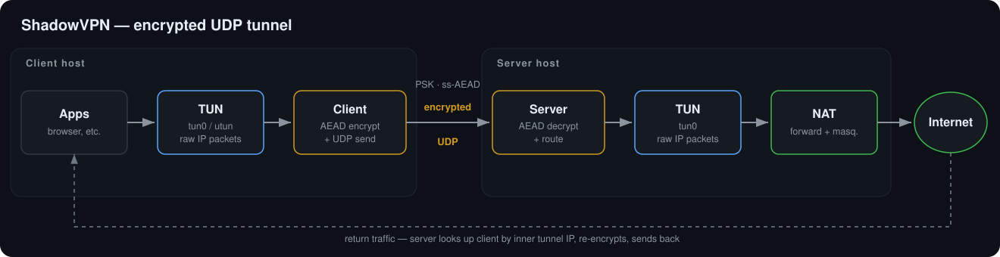
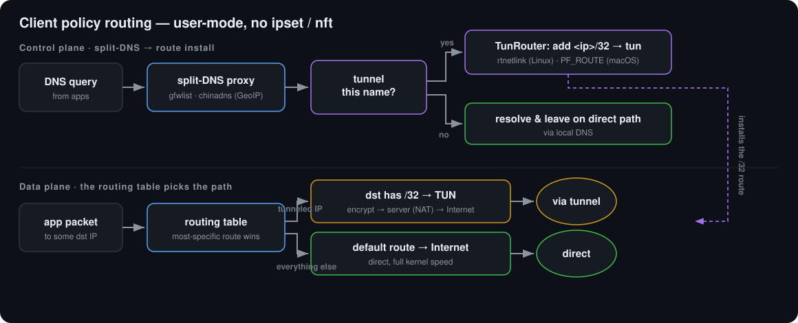

# Architecture & project layout

## Data flow

The client encrypts every TUN packet to the server over UDP; the server
decrypts, writes to its own TUN, and (with forwarding + NAT) lets traffic
egress. Return traffic is matched back to the client by its inner tunnel IP
and re-encrypted.



Design notes:

- **Pipelined relay loops** — on each relay direction a dedicated reader task
  drains the socket/TUN continuously and feeds a single ordered
  crypto-and-send processor, instead of a strict per-packet
  `recv → crypt → send` loop. Overlapping the receive syscall with the crypto
  roughly triples single-flow TCP at high rates (see
  [benchmarks](./benchmarks)).
- **Enlarged socket buffers** — UDP sockets are created with enlarged
  `SO_RCVBUF`/`SO_SNDBUF` so bursts aren't dropped at the socket.
- **Client-address learning** — the server maps each client's inner tunnel IP
  to its current UDP endpoint, learning (and re-learning after NAT rebinds)
  from keepalives and traffic. In [`--nat` mode](/guide/multi-client) the
  mapping is keyed by UDP 4-tuple instead, with inner-address rewriting.

## Policy routing (client)

In `gfwlist`/`chinadns` modes a split-DNS proxy decides per query and programs
per-destination host routes into the tun through the OS routing socket. The
control plane installs routes; the data plane is just the ordinary kernel
routing table.



See the [policy routing guide](/guide/policy-routing).

## Project layout

```
src/
  lib.rs          crate root + module docs
  crypto.rs       Cipher enum, EVP_BytesToKey, HKDF-SHA1 subkey, AEAD seal/open
  net.rs          UDP socket construction with enlarged SO_RCVBUF/SO_SNDBUF
  protocol.rs     tunnel framing constants and buffer sizing
  obfs.rs         optional carrier obfuscation (quic / base64 wire formats)
  config.rs       JSON file + clap CLI config, merge/validate
  tun_device.rs   async TUN wrapper (tun-rs: macOS utun, Linux, Windows Wintun)
  policy/         client policy routing (gfwlist / chinadns, user-mode)
    mod.rs        Mode, PolicyConfig, orchestration
    gfwlist.rs    domain-suffix matching
    chnroute.rs   China IP range lookup
    geoip.rs      build the China set from a GeoLite2 .mmdb
    dns.rs        minimal DNS wire parsing
    cache.rs      TTL-respecting DNS answer cache
    proxy.rs      split-DNS proxy + routing decisions (IpSink trait)
    route.rs      per-dest routes into the tun (rtnetlink / PF_ROUTE / IP Helper API)
    dnsconf.rs    point the system resolver at the proxy (networksetup / resolv.conf / netsh)
  bin/server.rs   server binary: UDP<->TUN forwarding + client routing table
  bin/client.rs   client binary: TUN<->UDP relay loops + keepalive + policy
docs/             this documentation site (VitePress)
dist/
  systemd/        Linux service units (server + client)
  launchd/        macOS client daemon
desktop/          Tauri v2 desktop GUI (experimental)
docker/           end-to-end tests + benchmark harness
scripts/
  shadowvpn-client.ps1   self-elevating Windows client launcher
  shadowvpn-client.cmd   execution-policy-bypass wrapper for the launcher
  gen-gfwlist.sh         regenerate assets/gfwlist.txt from upstream
assets/
  gfwlist.txt     vendored routing list bundled into release packages
```

## Dependencies

A deliberately small set: `tokio` for the async runtime, RustCrypto's
`aes-gcm` / `chacha20poly1305` for the AEAD, `tun-rs` for the cross-platform
TUN device, and `clap`/`serde` for config. Key derivation
(`EVP_BytesToKey`, HKDF-SHA1) is implemented in-tree.
