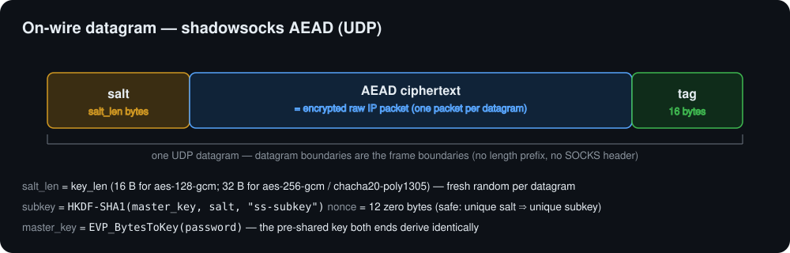

# Wire protocol

Each UDP datagram on the wire is:

```text
[ salt (salt_len bytes) ] ++ [ AEAD ciphertext ++ tag (16 bytes) ]
```



- **`salt_len == key_len`** of the cipher: 16 bytes for `aes-128-gcm`,
  32 bytes for `aes-256-gcm` and `chacha20-poly1305`. A fresh random salt is
  generated for **every** datagram.
- **Subkey:** `subkey = HKDF-SHA1(ikm = master_key, salt = salt,
  info = "ss-subkey", L = key_len)`.
- **Nonce:** the all-zero 12-byte nonce for every UDP packet. This is safe
  because each datagram has a unique random salt and therefore a unique
  subkey, so the `(subkey, nonce)` pair is never reused.
- **Master key:** derived from the password string with shadowsocks'
  `EVP_BytesToKey` (the OpenSSL legacy MD5-based KDF): repeatedly compute
  `d_0 = MD5(password)`, `d_i = MD5(d_{i-1} ++ password)`, and concatenate
  until `key_len` bytes are available. (Implemented in-tree; no external
  crate.)
- **Plaintext:** the raw IP packet read from the TUN device. UDP datagram
  boundaries are the frame boundaries — there is no length prefix, no
  multiplexing, and no reassembly. One IP packet maps to exactly one datagram.

The scheme is the **shadowsocks.org AEAD UDP scheme**, matched byte-for-byte,
with one deliberate deviation below.

## Deviation from ss-proxy

Standard shadowsocks UDP relays prepend a SOCKS-style target address to the
plaintext. **ShadowVPN does not.** This is a fixed point-to-point tunnel, not
a SOCKS proxy: the plaintext is exactly the raw IP packet, with no address
header. Everything else (salt, HKDF-SHA1 `"ss-subkey"` subkey, zero nonce,
AEAD tag) matches the shadowsocks UDP AEAD scheme byte-for-byte. This
deviation is also documented in
[`src/crypto.rs`](https://github.com/madeye/shadowvpn/blob/main/src/crypto.rs)
and
[`src/protocol.rs`](https://github.com/madeye/shadowvpn/blob/main/src/protocol.rs).

## Keepalive

*A ShadowVPN convention, not part of the ss spec.*

The client periodically sends a tiny encrypted datagram — a 5-byte plaintext:
a `0x00` marker followed by the client's 4-byte tunnel IP — so that stateful
NAT/firewall mappings stay open and the server learns the client's current
source address before any real traffic flows.

- In the default **learning mode**, the announced tunnel IP lets the server
  map (and re-map, after a NAT rebind) the client's UDP address from the
  keepalive alone.
- In [`--nat` mode](/guide/multi-client), the keepalive refreshes an existing
  lease, and the mapping itself is allocated by the first real packet.

The server drops any decrypted payload smaller than a 20-byte IPv4 header, so
the keepalive never reaches the TUN write path (older 1-byte `0x00`
keepalives are still accepted and treated as refresh-only).

The interval is 15 seconds by default (`keepalive_secs` /
`--keepalive-secs`) — keep it below the path's UDP NAT timeout.

[Auto-assign](/guide/auto-assign) clients replace this 5-byte keepalive with
an `AssignRequest` (type `0x03`) on the same interval. Static clients are
unchanged.

## Control channel

Control messages share the tunnel's plaintext channel with IP packets. Every
control payload starts with a `0x00` byte — an IP packet's first nibble is
its version (4 or 6), so the two can never collide. Typed messages are
**not** 1 or 5 bytes (those lengths stay keepalives). Unknown types and
wrong lengths return `None` and are dropped, so old and new peers
interoperate.

```text
keepalive   : 00                      (legacy, 1 byte)
keepalive   : 00 ip4[4]               (legacy, 5 bytes)
route advert: 00 01 flags ip4[4] ip6[16] count { family plen addr[4|16] }*
route push  : 00 02 00    count { family plen addr[4|16] }*
assign req  : 00 03 flags node[16] hint4[4] hint6[16]     (39 bytes)
assign      : 00 04 status ip4[4] mask[4] peer[4] ip6[16] plen6 flags ttl[4]
                                                              (37 bytes)
name advert : 00 05 flags ip4[4] ip6[16] nlen name[nlen]
peer push   : 00 06 flags count { eflags ip4[4] ip6[16] nlen name[nlen] }*
```

### `AssignRequest` — 39 bytes, type `0x03`

| Offset | Len | Field |
|--------|-----|-------|
| 0 | 1 | `0x00` marker |
| 1 | 1 | type `0x03` |
| 2 | 1 | `flags` (bit 0 = want IPv6; other bits 0) |
| 3 | 16 | `node_id` (persisted locally; not in the URI/QR) |
| 19 | 4 | `hint_ip4` (`0.0.0.0` = no hint) |
| 23 | 16 | `hint_ip6` (`::` = none) |

### `Assign` — 37 bytes, type `0x04`

| Offset | Len | Field |
|--------|-----|-------|
| 0 | 1 | `0x00` marker |
| 1 | 1 | type `0x04` |
| 2 | 1 | `status` (`0` Ok, `1` Exhausted, `2` NatMode) |
| 3 | 4 | assigned `tun_ip` |
| 7 | 4 | netmask (server TUN netmask, not the pool mask) |
| 11 | 4 | `peer_ip` (server TUN IPv4) |
| 15 | 16 | `tun_ip6` (`::` if none) |
| 31 | 1 | `plen6` (`0` means no IPv6) |
| 32 | 1 | `flags` (v1: must be 0) |
| 33 | 4 | `ttl_secs` (u32be; client logs only) |

Parse requires **exact** length — 36- or 38-byte replies are dropped. A
5-byte payload whose second byte happens to be `0x03` or `0x04` is still a
keepalive.

Hex example of an Ok reply: assigned `10.9.0.37/24`, peer `10.9.0.1`, IPv6
`fd07:7::a09:25`/64 (the IPv4 embedded in octets `[12..16]` of
`fd07:7::/64`), flags 0, ttl 604800:

```
00 04 00
0a 09 00 25
ff ff ff 00
0a 09 00 01
fd 07 00 07 00 00 00 00 00 00 00 00 0a 09 00 25
40
00
00 09 3a 80
```

Status ≠ Ok uses the same 37-byte layout with zeroed addresses; the client
must not program them. There is no `Conflict` status — a taken hint is
skipped and the server still returns Ok with a different address (or
Exhausted).

### `NameAdvert` — variable length, type `0x05`

| Offset | Len | Field |
|--------|-----|-------|
| 0 | 1 | `0x00` marker |
| 1 | 1 | type `0x05` |
| 2 | 1 | `flags` (bit 0 = want peer push) |
| 3 | 4 | client's tunnel IPv4 |
| 7 | 16 | client's tunnel IPv6 (`::` = none) |
| 23 | 1 | `nlen` (0–32) |
| 24 | nlen | hostname label (UTF-8). `nlen = 0` withdraws the name |

Minimum length 24 (empty name). Not 1 or 5 bytes. See
[Magic DNS](/guide/magic-dns).

### `PeerPush` — variable length, type `0x06`

| Offset | Len | Field |
|--------|-----|-------|
| 0 | 1 | `0x00` marker |
| 1 | 1 | type `0x06` |
| 2 | 1 | reserved (0) |
| 3 | 1 | `count` (0–24) |
| 4 | … | `count` entries: `eflags`(1) `ip4`(4) `ip6`(16) `nlen`(1) `name` |

`eflags` bit 0 = has IPv6 (`ip6` is `::` and ignored when clear). An empty
push is 4 bytes. The snapshot includes the server and the requesting client.

Route advert / push are documented in the
[mesh routing guide](/guide/mesh-routing#wire-format).

## Optional carrier obfuscation

The `salt ++ AEAD` envelope can optionally be wrapped in a cosmetic carrier —
a QUIC 1-RTT short-header framing or base64 encoding — before hitting the
wire. This changes nothing above: the envelope is unwrapped before decryption.
See [carrier obfuscation](./obfuscation).
